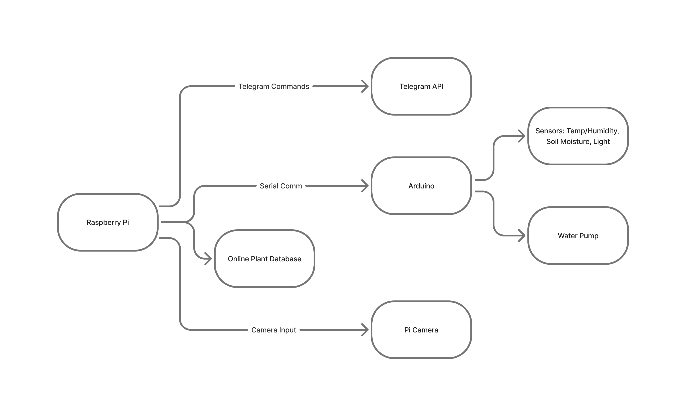
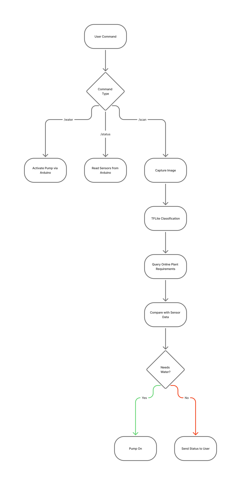
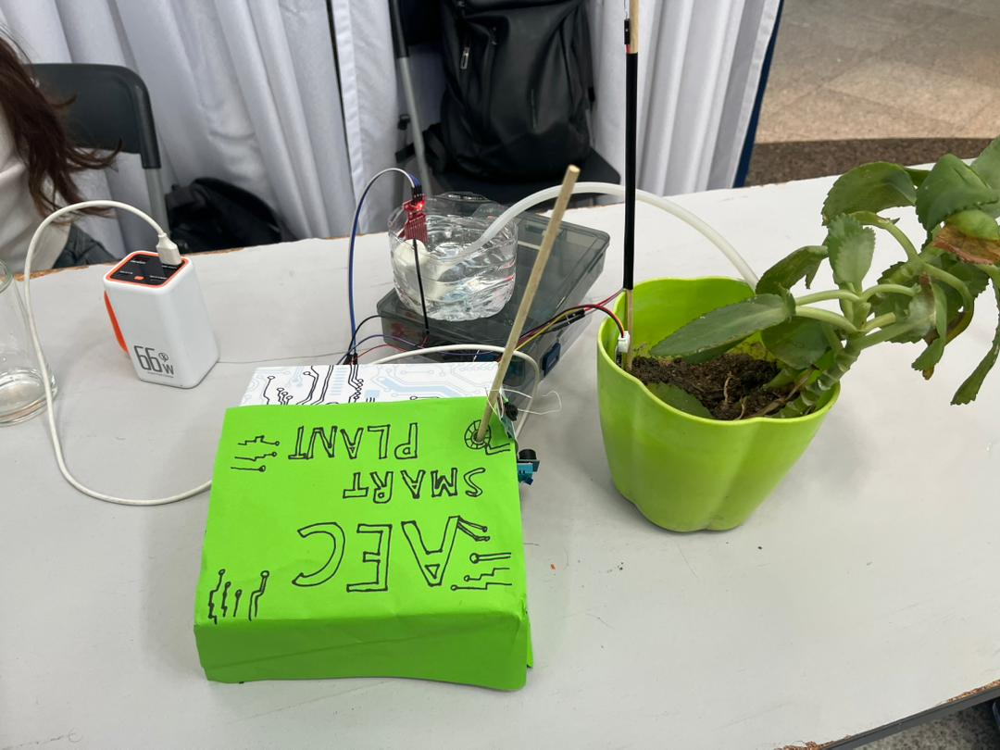
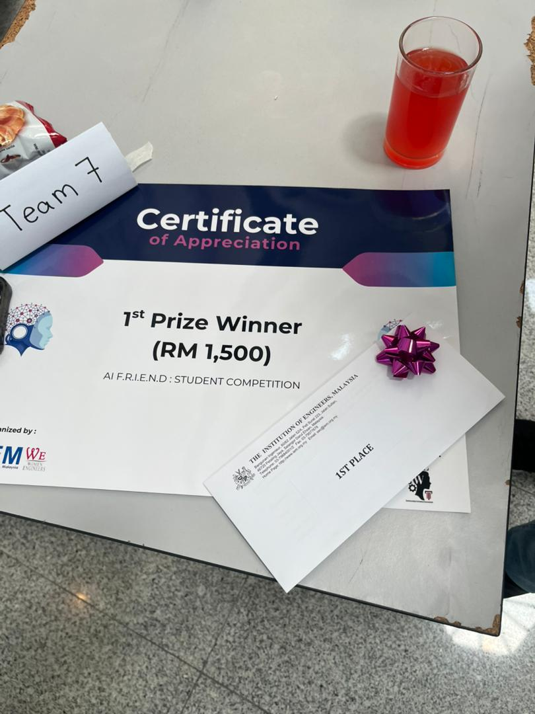

# Smart Plant Pot – AI-Powered Plant Health & Automation System  
*Edge Vision AI · Embedded Sensors · Raspberry Pi + Arduino · Telegram Bot Control*

This project is an end-to-end **autonomous plant-care system** combining **Raspberry Pi**, **Arduino**, **TensorFlow Lite**, and multiple environmental sensors to monitor plant health, classify plant species, and automate watering.  
The entire system runs **on-edge**, enabling fast real-time inference and offline operation.

---

## Features

### 1. Vision AI Plant Classification
- Captures plant images via Raspberry Pi Camera  
- Classifies using TensorFlow Lite (trained on 14k samples, 47 classes, ~86% accuracy) on the dataset of [house-plant-species](https://huggingface.co/datasets/kakasher/house-plant-species/tree/main)
- Sends the detected plant name via Telegram  
- Sub-second inference on Raspberry Pi  

### 2. Real-Time Environmental Monitoring
Arduino continuously collects:
- Temperature  
- Humidity  
- Soil Moisture  
- Light Intensity  

### 3. Automated & Manual Watering
- Automatic watering based on plant requirements  
- Manual watering available via `/water`  

### 4. Telegram Bot Remote Interface
Supported commands:
- **`/scan`** — Capture & classify plant  
- **`/status`** — Show all sensor readings  
- **`/water`** — Activate pump  

### 5. Smart Recommendation Logic
After classification, the Pi checks an online database for:
- Optimal temperature  
- Ideal humidity range  
- Recommended watering schedule  

Then compares these values with real sensor readings.

---

# How-to Setup
well you can either:
1. download the dataset and place it in data_raw, then run the notebooks in order
or
2. just straight away add the tflite file to the raspberry pi

- then make sure that the code in the Arduino folder (main.ino) is uploaded to the uno, follow the file for pin connection instructions

- connect the Arduino to the pi via serial usb cable

- make sure the pi camera is mounted correctly
- try it out for yourself (I have removed my telegram API Key so you can add yours)

---

# System Architecture

Below is the high-level structure of the entire system.

### Architecture Diagram  

---

# System Logic Flowchart

This flowchart explains the logical flow of commands, sensors, and AI inference.

### Flowchart Diagram  

---

# Hardware Used

- Raspberry Pi 4  
- Arduino UNO / Nano  
- Raspberry Pi Camera Module  
- DHT11 / DHT22 (Temp & Humidity)  
- Soil Moisture Sensor  
- Light Sensor (LDR / Lux Sensor)  
- Relay + Mini Water Pump  
- Jumper wires, tubing, water reservoir  

---

# Software Stack

### Raspberry Pi (Python)
- TensorFlow Lite  
- OpenCV  
- pySerial  
- Python Telegram Bot API  
- Custom automation & logic scripts  
- Plant database lookup  

### Arduino (C++)
- Sensor drivers  
- Water pump control  
- Serial communication (to Pi)  

---

# Command Overview

### `/scan`
- Captures a photo  
- Classifies the plant using TFLite  
- Retrieves plant-care requirements  
- Sends result to user  

### `/status`
- Reads temperature, humidity, soil moisture, and light  
- Returns all sensor values  

### `/water`
- Activates water pump  
- Sends confirmation  

---

# Future Improvements

- Add CO₂, VOC, and pH sensors  
- Replace Telegram with a **Flutter mobile app**  
- Add real-time dashboard with Flask / FastAPI  
- Move entire system to **ROS2 nodes**  
- Add ML-based watering prediction  
- Add local SQLite plant database  
- Make the system solar-powered  

---

# 🏆 Achievements

- **1st Place Winner — IEM A.I F.R.I.E.N.D.S 2025**  
- Fully integrated edge AI + embedded control pipeline  
- Strong modular architecture with expandability  

---

# 📸 Photos  
(Place your images inside `images/demo/`)

---

# Contact
> Just in case you want to hire me :)

LinkedIn: https://www.linkedin.com/in/eyad-mohamed-363b07238/  
Email: eyadmoali05@gmail.com  

---
